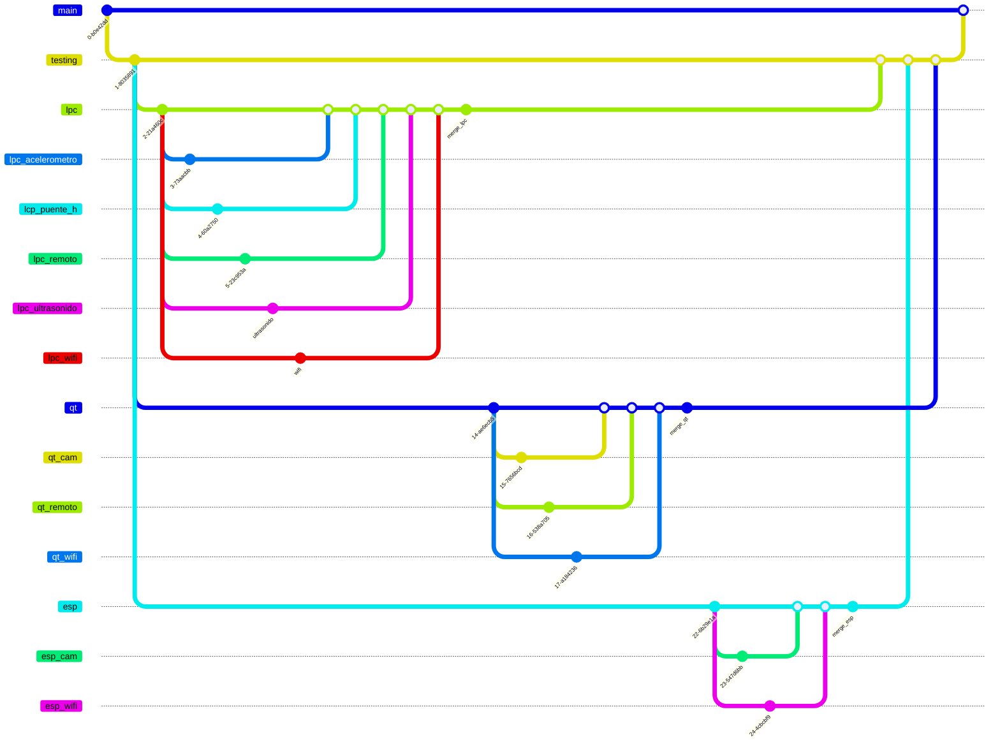

# TPI - Informática 02 - UTN.FRBA   
## Integrantes:   
* Juanes  Francisco  (221.033-2)   
* Román   Mateo      (220.926-3)   
* Yopolo  Iván       (233.133-0)   

## Idea fuerza:   
Desarrollar un rover terrestre inspirado en los robots de exploración espacial, capaz de desplazarse a control remoto, detectar obstáculos y transmitir información del entorno hacia una computadora en tiempo real. Además, el rover debe captar imagen en vivo (cámara), más un mapeo del entorno por curvas de nivel con colores en una interfaz gráfica. Nuestra decisión fue por el deseo de realizar un *Mars Rover de la NASA*.      

### Desafíos:
* Control de potencia (PWM).   
* Conexión por WiFi.   
* Mapeo topográfico del terreno.   
* Interfaz gráfica.   
* Procesamiento de imágenes en tiempo real.   

### Hardware adicional:   
* Doble Puente H.   
* Acelerómetro.   
* Sensor emisor/receptor Ultrasónico.   
* Módulo WiFi.   

---

## Repositorio:   
Nos dividimos el trabajo en varias partes:   

### LPC845   
* Protocolo de comunación (WiFi).   
* Manejo de motores (Puente H).   

### ESP32   
* Procesamiento de imagen (cámara).   
* Protocolo de comunación (WiFi).   

### PC (Qt)   
* Protocolo de comunación (WiFi).   
* Mapeo topográfico del terreno según input del ultrasónico del LPC.   

---

## Ramas (branches):   

> [!WARNING]
> Nostros vamos a trabajar con un flujo de trabajo o "workflow" **ascendente**. Es decir, la dependencia se da **hacia arriba**. *Una rama NO PUEDE DEPENDER de las que originan de ella misma*. Ej.: si "main" es la principal, no depende de nadie; si "testing" es la primera rama que deriva de "main", entonces *testing depende de main y NO AL REVÉS*; cualquier otra rama debe de depender de "testing" y así...   





* **main**: Donde se publican lo funcional para el proyecto entero. "MERGEAR" O "PUSHEAR" **SOLAMENTE CUANDO SEA ESTRICTAMENTE NECESARIO**. Vamos a tener que resolver conflictos seguramente.

   * **testing**: Rama a "pushear" o "mergear" para probar nuevos cambios entre ramas y compatibilidad. TIENE QUE SER CASI **COPIA EXACTA** DE RAMA "main". Al terminar trabajo en otras ramas, para probar funcionalidades, se "mergea" a esta, se testea compatibilidad con otras funcionalidades, se resuelven conflictos, etc. *Hay que dejar la rama "main" lo más limpia posible.*    

      * **lpc**: Rama a trabajar sobre el LPC. **Toda funcionalidad y tópico debe de ser una rama derivada de esta** (para respetar un orden).   

         * **lpc_acelerometro**: Funcionalidad de acelerómetro en el LPC; lectura y procesamiento de datos del sensor.   

         * **lpc_puente_h**: Funcionalidad del Puente H (doble); manejo de motores por LPC. No olvidar que corroborar HW (HardWare), verificando si aguanta la corriente de salida el LPC o si necesitamos transistores/relés de por medio.   

         * **lpc_remoto:** Funcionalidad de control remoto según input de PC; traducción de comandos recibidos por WiFi a manejo de motores. Hacerlo modular para implementar en rama "lpc_puente_h".

         * **lpc_ultrasonido**: Funcionalidad de sensor ultrasónico; lectura y procesamiento de dicho sensor.

         * **lpc_wifi**: Funcionalidad de WiFi para el LPC; protocolo por HW externo + recibir y enviar datos por él (útil para otras funcionalidades).

      * **qt**: Rama a trabajar en C con Qt (PC). Trabajo sobre procesamiento de imágen del ESPCAM, protocolo WiFi, teclado como control remoto, etc.

         * **qt_cam**: Funcionalidad de procesamiento de imágen (cámara) en pantalla.

         * **qt_remoto**: Funcionalidad de teclado como control remoto; traduce teclas a instrucciones y guarda datos en buffer. **Decidir si se guardan datos en buffer global, donde la funcionalidad de WiFi agarra, o si llama a las funciones de WiFi cada vez que presiona una tecla, como interrupción**.

         * **qt_wifi**: Funcionalidad de protocolo WiFi.

      * **esp**: Rama a trabajar sobre implementaciones del ESPCAM (WiFi + cámara).

         * **esp_cam**: Funcionalidad de procesamiento de imágen. Llama a funciones de WiFi para envío de datos.

         * **esp_wifi**: Funcionalidad de WiFi para conectarse con la PC + envío de imágen.


> [!NOTE]
> Ejemplo bueno:
```bash
git checkout lpc
git merge lpc_remoto --no-commit

# ...
# Se sigue desarrollando la rama de "lpc" hasta que la nueva implementación quede funcional.
# ...

git commit -m "merge: lpc_remoto -> lpc [FUNCIONAL]"

# ...
# Al probar que esté todo OK con toda la rama "lpc", se pasa la implementación a la rama "testing".
# ...

git checkout testing
git merge lpc --no-commit

# ...
# Se sigue desarrollando la rama de "testing" hasta que la nueva implementación quede funcional.
# ...

git commit -m "merge: lpc -> testing [FUNCIONAL]"
```

